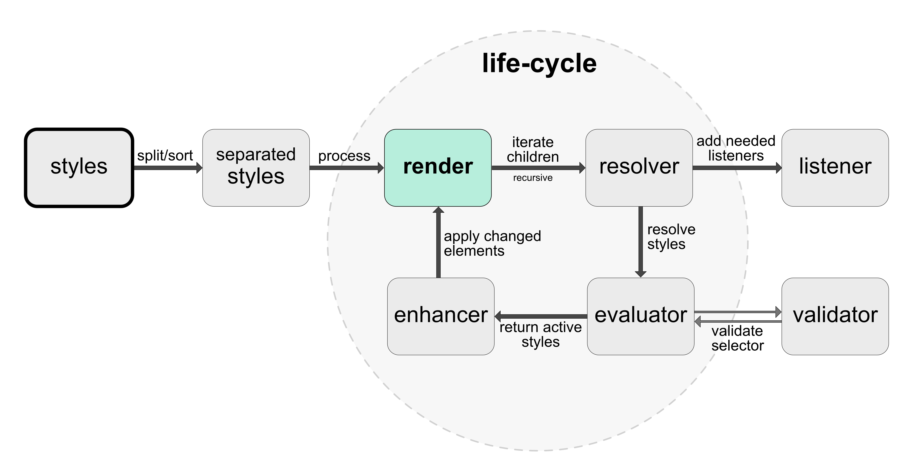

[< **1. Getting started** ](PseudoClasses.md)

[**3. Pseudo classes** >](PseudoClasses.md)

# 2. Under the hood
## Dynamic Style Sheets
Under the hood Look is based on **[Dynamic Style Sheets](https://github.com/dynamicstylesheets)** which is an lightweight interface for style object manipulation. It also ships an interface for dynamic CSS sheet interaction that automatically diffs changes to your DOM which might be used in an early stage to add unsupported CSS-features.  _(Check the organisation for more information)_.

### Processors
DSS (Dynamic Style Sheets) inlcude a processor interface that let's you apply any valid processor e.g. [Vendor Prefixing](https://github.com/dynamicstylesheets/DSS-Prefixer). See this frequently updated  [list](https://github.com/dynamicstylesheets/Dynamic-Style-Sheets#available-processors) for all available processors I've done so far.

**Power up your styles for your own custom needs!**

## Life cycle
Similar to Radium, Look wraps the `render` function and modifies applied styles while iterating recursive over all children. It adds missing event listeners to match `:hover`, `:active`, `:focus` and `:valid`, `:invalid`. Those action states get saved within your wrapping component _(You can adress those with the [State API](docs/api/State.md))_.  It also counts (type-specific) indexes to validate index-specific pseudo classes such as `:nth-child` or  `:nth-type-of`. 